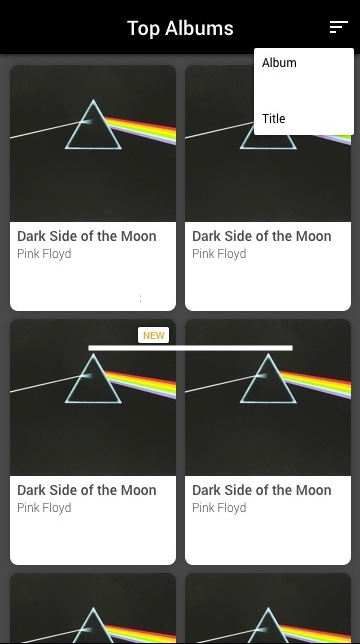

# itunes-challenge

A client has an idea for an application but all that's been provided is the following description and mockup:

```
I want an app where you can see the best music albums from iTunes. It 
should have a modern design. They should also be able to sort the albums.
I tried to make the app myself but I am too busy. Recently released albums 
should also be noted. Thanks.

For reference here is the api we are using: https://rss.itunes.apple.com/en-us
```


- Architectures & Frameworks
- SOLID Principles
- File Structure
- Naming Conventions
- Bugfixes & Improvements
- Testing
